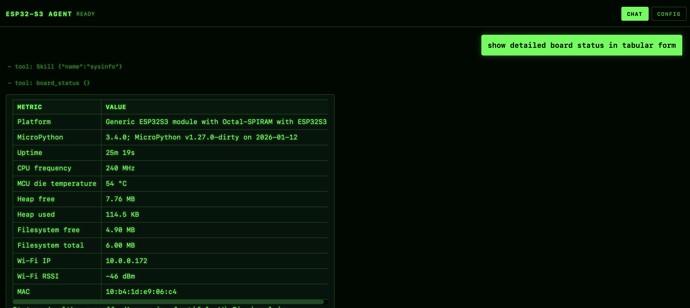
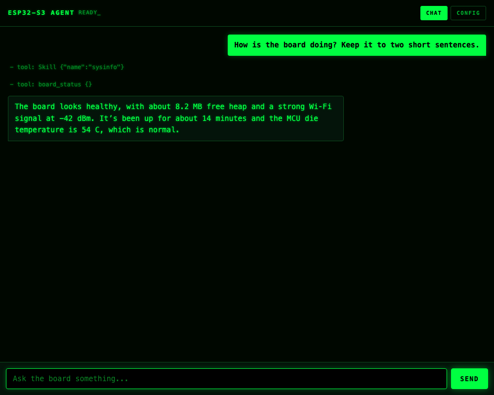
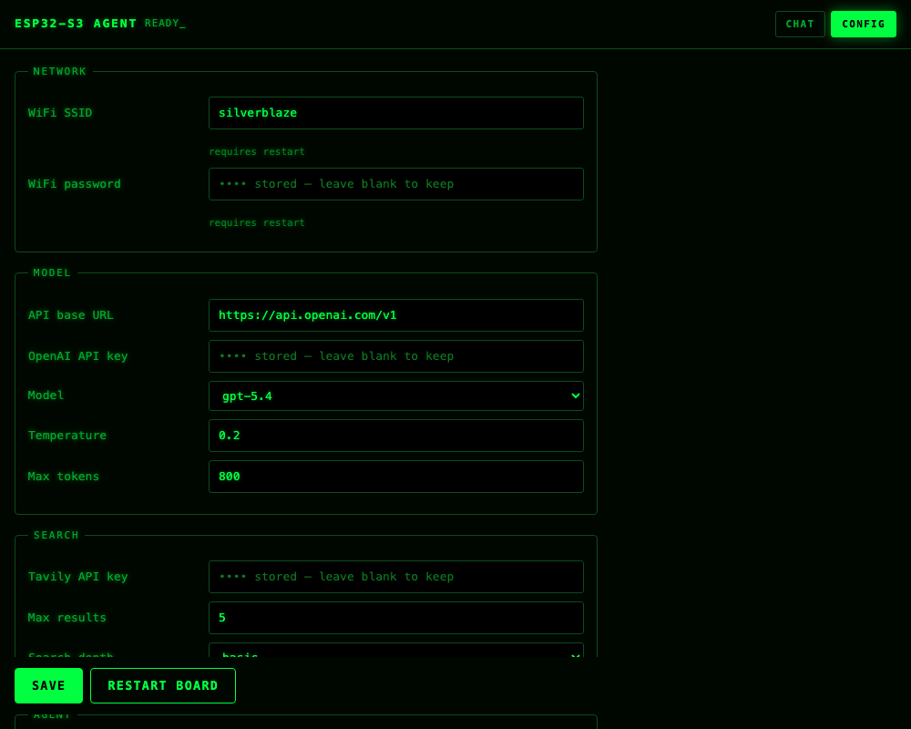

# An AI Agent That Runs *On* an ESP32-S3 (Not On Your Laptop)

*Chat with a board on your LAN. It can blink its LED, check its own health, take a photo, log temperature as a text chart, and grow new skills on its own flash — all in MicroPython.*

---

Most “ESP32 + AI” projects put the brain on a PC or cloud worker and use the microcontroller as a dumb sensor. This one flips that around.

**esp32s3-ai-agent** is an AI agent that runs **on** a Seeed XIAO ESP32S3 Sense. It calls an OpenAI-compatible API for reasoning, but the tool loop, skills, web UI, and hardware control all live on the board.

**Repo:** [https://github.com/mngaonkar/esp32s3-ai-agent](https://github.com/mngaonkar/esp32s3-ai-agent)

---

## The idea in one picture

```
Phone / laptop browser  ──HTTP──►  ESP32-S3 agent
                                      │
                                      ├─ skills (instructions on flash)
                                      ├─ tools (LED, camera, files, search…)
                                      └─ HTTPS ──►  OpenAI-compatible API
```

You open a page on your local network. You type a message. The board:

1. Builds a system prompt that lists available **skills** (name + short description only)
2. Calls the model with **tools**
3. Runs tool calls on real hardware (and may **retry** on failure within a large tool-round budget)
4. Returns a reply as **text** the web UI renders (markdown, code fences, inline photos)

That split is intentional:

| Layer | Role |
|--------|------|
| **Skills** | How to use *this* board (pins, how to report heap, how to plot…) |
| **Tools** | Capability (`led_set`, `board_status`, `take_photo`, `write_file`, `delete_file`…) |
| **Model** | Decides what to do next |

New skills are folders with a `SKILL.md` on the board’s filesystem. No reflash to add a procedure. The agent can also **author skills itself** when you describe one, or when it finishes a multi-step task worth remembering.

---

## What it looks like

The web UI is a small Matrix-style chat served **from the board** — no cloud frontend.

### Empty chat



### A real turn (skill + tool + answer)



Here the model first loaded the `sysinfo` skill, then called `board_status`, then answered in plain language. Progressive skill loading follows Anthropic-style skills: don’t stuff every instruction into the prompt up front.

### Config on the device



- Secrets stay on the board (“stored — leave blank to keep”).
- **Model** can be a **dropdown** filled from `GET {base_url}/models` when the key works; otherwise a text field with a hint.
- CA bundle path is **read-only** in the UI (change via deployed `config.json`).
- Wi‑Fi and port changes need a restart; most other settings apply live.
- **Max tool rounds** defaults to **50** so skill authoring and fix/retry loops can finish.

> **Screenshots** were taken against a live board (`http://<board-ip>/`). On Medium, upload the PNGs from `docs/medium/` (relative paths won’t resolve in the editor).

---

## Hardware

| | |
|--|--|
| Board | **Seeed XIAO ESP32S3 Sense** |
| Why it works | 8 MB octal **PSRAM**, camera (**OV3660** on this unit), user LED (GPIO21, active-low), Wi‑Fi |
| Runtime | **MicroPython** (camera-capable build: [micropython-camera-API](https://github.com/cnadler86/micropython-camera-API)) |

PSRAM is what makes conversation history, TLS, and JSON practical on a microcontroller.

**Not supported here:** the onboard **PDM microphone** (MicroPython has no PDM RX). Audio recording was tried and removed.

**Trust model:** the web UI and chat API are unauthenticated. Trusted LAN only — not the public internet.

---

## Quick deploy from GitHub

### What you need

- XIAO ESP32S3 Sense (or similar ESP32-S3 + PSRAM + USB)
- USB cable that carries data
- Python 3 on your computer
- Wi‑Fi and an OpenAI-compatible API key

### 1. Clone

```bash
git clone https://github.com/mngaonkar/esp32s3-ai-agent.git
cd esp32s3-ai-agent

python3 -m venv .venv
source .venv/bin/activate   # Windows: .venv\Scripts\activate
pip install esptool mpremote
```

### 2. Flash the image

Put the board in **download mode**: hold **BOOT**, tap **RESET** (or hold BOOT while plugging USB), wait a few seconds, release BOOT.

```bash
tools/flash.sh
```

That writes a prebuilt image (MicroPython + agent filesystem). Credentials are **not** in the image.

### 3. First-time setup over **serial**

Setup is still console-based (no captive portal). Power-cycle **without** holding BOOT, then:

```bash
tools/console.sh
```

On first boot the board asks for what it cannot guess:

- Wi‑Fi SSID  
- Wi‑Fi password  
- API key  

Optional: model, Tavily key (web search). Everything else has defaults and can be changed later in the web **Config** tab once you’re online.

When setup finishes you should see something like:

```text
[wifi] connected, ip=10.0.0.x
[skills] loaded …
[boot] web chat at http://10.0.0.x:80/
```

### 4. Open the chat

On a phone or laptop on the **same Wi‑Fi**, open the printed URL.

```bash
tools/start.sh    # reset + print the web address again
```

Serial and web share one agent (a small console reader thread keeps the web server responsive while you type).

### Day-to-day development (no full reflash)

```bash
tools/deploy.sh              # push code + skills; leaves /config.json alone
tools/deploy.sh --config     # also overwrite board config from local config.json
tools/start.sh
```

---

## Try these prompts

| You say | What it tends to do |
|---------|---------------------|
| “How is the board doing?” | `sysinfo` → `board_status` |
| “Blink the LED three times” | `led` → `run_script` blink |
| “Take a photo” | `camera` → `take_photo` (web can show the image inline) |
| “Monitor MCU temperature for 1 minute” | `temp-monitor-plot` → CSV + text plot under `/tmp` |
| “Plot `/tmp/mcu_temp.csv`” | `tui-plot` → Unicode/ASCII chart (paste in a code fence in chat) |
| “What’s the weather in …?” | `web_search` if Tavily is configured |
| “Teach the board a skill that …” | `write-skill` → draft, test, iterate on errors, save under `/skills/` |

Or the same agent over REST:

```bash
curl -s -X POST "http://<board-ip>/api/chat" \
  -H "Content-Type: application/json" \
  -d '{"message":"In one sentence, what board are you on?"}'
```

History is **one shared conversation** on the device (web, serial, and REST) until reboot or a reset.

---

## How skills work

A skill is a directory on the board:

```text
/skills/led/SKILL.md
/skills/led/scripts/blink.py
```

| Level | What | When |
|-------|------|------|
| **1** | name + description | Always in the system prompt |
| **2** | full `SKILL.md` body | Model calls `Skill("name")` |
| **3** | scripts / files | `read_file` / `run_script` |

### Bundled skills (repo)

| Skill | Purpose |
|--------|---------|
| `sysinfo` | Heap, FS, die temp, Wi‑Fi, uptime |
| `led` | Onboard LED + GPIO guidance |
| `camera` | Photos (BMP on this firmware; JPEG path not used) |
| `netscan` | Wi‑Fi survey / channel notes |
| `websearch` | When and how to use Tavily |
| `temp-monitor-plot` | Sample MCU die temp → CSV + simple text plot |
| `tui-plot` | Redraw a CSV as a text-mode chart for chat/serial |
| `write-skill` | How the agent creates/updates skills |

### The agent can grow its own skill list

- **You describe a skill** → it plans, writes `/skills/<name>/SKILL.md`, optional scripts under `/tmp` then into the skill folder.  
- **Or** after a multi-step task that worked and is likely to recur, it may **save a skill proactively**.  
- On errors it should **read the failure, change something, and retry** (tool-round budget defaults to **50**).  
- **`delete_file`** can remove a failed skill directory under `/skills/` and reload the catalog.  
- Filesystem writes for skills/media are limited to `/skills/`, `/tmp/`, `/photos/`, `/audio/` so the agent cannot wipe firmware paths by accident.

There is no curses/LVGL TUI on this image. “Graphs” are **formatted text** (code fences) that the web UI renders as monospaced markdown — or CSV you open on a host for a real GUI plot.

---

## What this is *not*

- Not a cloud agent that merely *talks about* an ESP32  
- Not first-boot setup from the phone alone (serial still required once)  
- Not onboard PDM mic recording, Discord gateway, NFS, or H.264 streaming  
- Not secure on an untrusted network (no login on the web UI)

It *is* a small on-device agent loop: tools, progressive skills, LAN chat + REST, OpenAI-compatible backend, skills that can grow on flash.

---

## Links

- **GitHub:** [mngaonkar/esp32s3-ai-agent](https://github.com/mngaonkar/esp32s3-ai-agent)  
- **Camera MicroPython upstream:** [cnadler86/micropython-camera-API](https://github.com/cnadler86/micropython-camera-API)  
- Screenshots: `docs/medium/` in the repo  

---

## Closing

If you already own an ESP32-S3 Sense and an API key, you can go from clone → flash → serial setup → chat in a single sitting. The interesting part is not “LLM on a microcontroller” as a stunt — it’s that **skills and tools live next to the metal**, so the model can operate *this* board and teach itself new procedures without a reflash.

Clone it, flash it, answer three questions on the console, open the green terminal on your LAN, and ask the board how it’s doing.

---

*Article source: `ARTICLE.md` in the project repo. Images: `docs/medium/01-web-chat.png`, `02-chat-reply.png`, `03-config.png`.*
